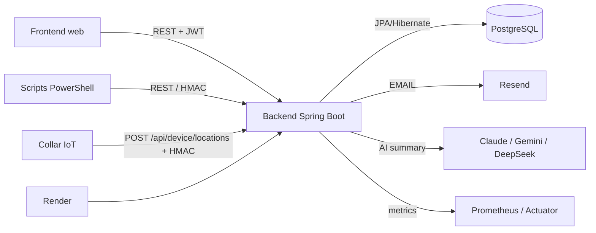
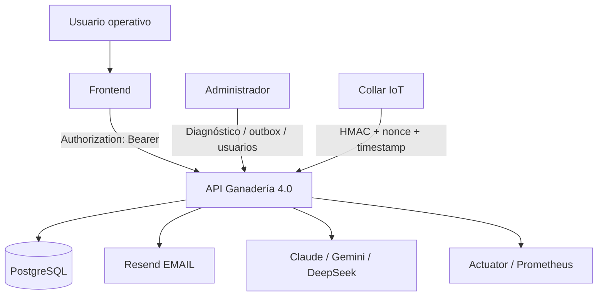

# Arquitectura técnica — Ganadería 4.0

## 1. Propósito del documento

Este documento describe la arquitectura backend de Ganadería 4.0, sus decisiones técnicas principales y los flujos críticos que sostienen la operación del sistema. Está escrito para servir como soporte técnico ante jurado universitario, profesor, revisor backend o arquitecto que necesite entender cómo está organizado el proyecto y qué garantías ofrece.

## 2. Visión general del sistema

Ganadería 4.0 es un backend de monitoreo ganadero construido sobre Spring Boot. Integra gestión administrativa, monitoreo IoT, alertas operativas, notificaciones, reportes, análisis con IA y observabilidad.

El sistema expone una API REST consumida por un frontend web y por scripts operativos. Los dispositivos o collares reportan ubicaciones mediante un endpoint IoT firmado con HMAC. La información se persiste en PostgreSQL y se procesa para actualizar estados, generar alertas, activar notificaciones, alimentar reportes y producir análisis operativos.

Visión de alto nivel:



## 3. Contexto arquitectónico

Actores y sistemas externos:

- Frontend web: consume la API REST, usa JWT y no genera tokens técnicos de vaca/collar.
- Dispositivos/collares IoT: reportan ubicaciones con token de dispositivo, timestamp, nonce y firma HMAC.
- PostgreSQL: base de datos relacional principal.
- Resend: proveedor de email real.
- Claude (Anthropic): proveedor de IA por defecto para resumen analítico de alertas (modelo `claude-haiku-4-5-20251001`).
- Google Gemini: proveedor de IA alternativo.
- DeepSeek: proveedor de IA alternativo.
- Render: plataforma de despliegue del backend.
- Swagger/OpenAPI: documentación interactiva de endpoints.
- Actuator/Prometheus: health checks, métricas y observabilidad.

Diagrama de contexto:



## 4. Stack tecnológico

Stack real verificado:

| Tecnología | Versión | Rol |
|---|---|---|
| Java | 17+ | Lenguaje principal |
| Spring Boot | 4.0.3 | Framework base |
| Spring Web MVC | — | Capa HTTP/REST |
| Spring Security | — | Autenticación y autorización |
| JJWT | 0.12.7 | Tokens JWT |
| JPA/Hibernate | — | ORM |
| PostgreSQL | — | Base de datos relacional |
| Flyway | — | Migraciones versionadas |
| Spring Boot Actuator | — | Health checks y endpoints operativos |
| Micrometer/Prometheus | — | Métricas scrapeables |
| Springdoc OpenAPI | 3.0.2 | Swagger UI |
| Resend | — | Proveedor de EMAIL real |
| Claude (Anthropic) | claude-haiku-4-5-20251001 | IA analítica principal (proveedor por defecto) |
| Google Gemini | gemini-2.5-flash | IA analítica alternativa |
| DeepSeek | deepseek-chat | IA analítica alternativa |
| Maven Wrapper | — | Build reproducible |
| Testcontainers | — | PostgreSQL real en integración |
| JaCoCo | 0.8.13 | Cobertura de código |
| SpotBugs | 4.9.8.3 | Análisis estático |
| Render | — | Plataforma de despliegue |
| Scripts PowerShell | — | Operaciones y demos |

## 5. Organización por capas

El proyecto sigue una organización por paquetes y responsabilidades:

- `controller`: expone endpoints HTTP y delega la lógica al servicio correspondiente.
- `service`: concentra casos de uso, reglas de negocio y coordinación entre repositorios, validadores, notificaciones y métricas.
- `repository`: acceso a datos con Spring Data JPA y consultas agregadas cuando aplica.
- `model`: entidades JPA, enums y conceptos del dominio.
- `dto`: contratos HTTP de entrada y salida.
- `config`: configuración de seguridad, CORS, OpenAPI, Flyway, scheduling, propiedades y serialización.
- `security`: JWT, autenticación de dispositivo, anti-replay, abuso/rate limiting y limpieza asociada.
- `notification`: dispatcher, canales LOG/WEBHOOK/EMAIL, cliente Resend y outbox EMAIL.
- `observability`: correlación de request, logs seguros, métricas de dominio y health indicators.
- `pattern`: patrones aplicados alrededor del procesamiento de ubicación, alertas y geocercas.

Esta separación permite que los controladores se mantengan delgados, que las reglas queden testeables en servicios y que la persistencia permanezca aislada detrás de repositorios.

## 6. Módulos principales

| Módulo | Responsabilidad | Clases representativas | Endpoints principales |
| --- | --- | --- | --- |
| Auth/Users | Login, usuario actual, usuarios y recuperación de contraseña | `AuthController`, `AuthService`, `AuthPasswordResetService`, `UserService`, `JwtService` | `/api/auth/login`, `/api/auth/me`, `/api/auth/forgot-password`, `/api/auth/reset-password`, `/api/users` |
| Cows | Gestión de vacas, activación/desactivación operativa, token técnico y código interno generado por backend | `CowController`, `CowService`, `CowRepository`, `Cow` | `/api/cows`, `/api/cows/page`, `/api/cows/{id}`, `/api/cows/token/{token}`, `/api/cows/{id}/deactivate`, `/api/cows/{id}/activate` |
| Collars | Gestión de collares, asignación, habilitación, rotación de secreto y token técnico | `CollarController`, `CollarService`, `CollarRepository`, `Collar` | `/api/collars`, `/api/collars/{id}/rotate-secret`, `/api/collars/{id}/assign/{cowId}` |
| Locations | Registro manual/API de ubicaciones y consulta por vaca | `LocationController`, `LocationService`, `LocationRepository`, `Location` | `/api/locations`, `/api/locations/cow/{cowId}`, `/api/locations/cow/{cowId}/last` |
| Geofences | Gestión y evaluación de geocercas, activación/desactivación operativa | `GeofenceController`, `GeofenceService`, `GeofenceRepository`, `CircularGeofenceStrategy` | `/api/geofences`, `/api/geofences/page`, `/api/geofences/{id}`, `/api/geofences/{id}/deactivate`, `/api/geofences/{id}/activate` |
| Alerts | Gestión, consulta, resolución y descarte de alertas | `AlertController`, `AlertService`, `AlertRepository`, `Alert` | `/api/alerts`, `/api/alerts/page`, `/api/alerts/status/{status}`, `/api/alerts/{id}/resolve` |
| Reports | Reportes operativos y exportación CSV | `ReportController`, `AlertReportService`, `CollarReportService`, `CowIncidentReportService`, `ReportCsvService` | `/api/reports/alerts`, `/api/reports/alerts/page`, `/api/reports/alerts/trend`, `/api/reports/alerts/type-recurrence`, `/api/reports/alerts/export.csv`, `/api/reports/offline-collars`, `/api/reports/offline-collars/staleness`, `/api/reports/cows-most-incidents`, `/api/reports/cows-incident-recurrence` |
| Device ingestion | Recepción IoT firmada con HMAC | `DeviceController`, `DeviceRequestAuthenticationService`, `DeviceReplayProtectionStore`, `LocationService` | `/api/device/locations` |
| Notifications | Envío de notificaciones por LOG, WEBHOOK y EMAIL | `DefaultNotificationDispatcher`, `LoggingNotificationService`, `WebhookNotificationService`, `EmailNotificationService` | Usado internamente por eventos/alertas |
| Notification outbox | Persistencia y procesamiento diferido de EMAIL | `NotificationOutboxService`, `NotificationOutboxEmailProcessor`, `AdminNotificationOutboxController`, `NotificationOutboxMessage` | `/api/admin/notification-outbox`, `/api/admin/notification-outbox/{id}/requeue` |
| Alert analysis / IA | Análisis heurístico y resumen con Claude (Anthropic) por defecto; Gemini y DeepSeek como alternativas; fallback heurístico | `AlertAnalysisController`, `AlertAnalysisService`, `AlertAiAnalysisService`, `ClaudeAiClient`, `GeminiAiClient`, `DeepSeekAlertController` | `/api/alert-analysis/summary`, `/api/alert-analysis/top-priorities`, `/api/alert-analysis/ai-summary` |
| Observability | Logs, métricas, request correlation y health | `RequestCorrelationFilter`, `DomainMetricsService`, `DeviceMonitoringHealthIndicator`, `HealthzController` | `/healthz`, `/actuator/health`, `/actuator/metrics`, `/actuator/prometheus` |
| Scheduled jobs / cleanup | Limpiezas programadas | `DeviceReplayNonceCleanupJob`, `AbuseRateLimitCleanupJob`, `PasswordResetTokenCleanupJob`, `NotificationOutboxEmailProcessor` | Jobs internos programados |

## 7. Modelo de dominio resumido

| Entidad | Responsabilidad | Comentario técnico |
| --- | --- | --- |
| `User` | Usuario del sistema | Tiene rol operativo y participa en autenticación/autorización. |
| `Cow` | Animal monitoreado | Usa token técnico `COW-xxx` y código interno `INT-xxx` generados por backend. Campo `active` (booleano) permite activación/desactivación operativa sin borrar historial. |
| `Collar` | Dispositivo asociado a una vaca | Tiene token `COLLAR-xxx`, secreto de firma, estado, enabled y telemetría. |
| `Location` | Reporte de ubicación | Guarda coordenadas, timestamp, batería, precisión GPS y relación con vaca/collar. |
| `Geofence` | Zona geográfica | Permite evaluar permanencia/salida de animales. |
| `Alert` | Evento operativo | Representa situaciones como salida de geocerca, collar offline o batería baja. |
| `PasswordResetToken` | Token de recuperación | Se almacena hasheado, expira y puede marcarse como usado. |
| `DeviceReplayNonce` | Nonce IoT usado | Soporta protección anti-replay persistente. |
| `AbuseRateLimitEntry` | Registro de abuso/rate limiting | Soporta protección contra abuso en flujos sensibles. |
| `NotificationOutboxMessage` | Mensaje EMAIL en outbox | Permite envío diferido, reintentos, diagnóstico y requeue. |
| `UserNotificationPreference` | Preferencias de notificación | Controla canales, severidad mínima y email de destino. |

## 8. Seguridad

### 8.1 Seguridad de usuarios

El backend usa Spring Security con JWT. El flujo inicia en `POST /api/auth/login`, devuelve un token y luego los endpoints protegidos requieren:

```http
Authorization: Bearer <JWT>
```

Roles principales:

- `ADMINISTRADOR`.
- `SUPERVISOR`.
- `TECNICO`.
- `OPERADOR`.

La configuración de seguridad distingue 401 y 403:

- 401: no hay token válido o falta autenticación.
- 403: el usuario está autenticado, pero no tiene rol suficiente.

El bootstrap admin se controla por variables de entorno, con configuración en `AdminBootstrapConfig` y `AdminBootstrapProperties`.

### 8.2 Seguridad de dispositivos IoT

El endpoint IoT `POST /api/device/locations` está abierto a nivel de Spring Security para que no use JWT, pero tiene autenticación propia con HMAC en `DeviceRequestAuthenticationService`.

Headers requeridos:

- `X-Device-Token`.
- `X-Device-Timestamp`.
- `X-Device-Nonce`.
- `X-Device-Signature`.

Medidas aplicadas:

- Firma HMAC SHA-256 sobre una petición canónica.
- Timestamp ISO-8601 UTC validado contra una ventana temporal.
- Nonce único persistente para evitar replay.
- Validación de token de dispositivo.
- Validación de collar habilitado y estado operativo.
- No exposición pública de `DeviceSecret`.

### 8.3 Seguridad de recuperación de contraseña

El flujo de recuperación usa:

- Token seguro.
- Token hasheado en base de datos.
- Expiración.
- Marcado de token usado.
- Limpieza programada.
- Respuesta genérica para no revelar si un email existe o no.

El email puede enviarse directo o encolarse en outbox según configuración.

### 8.4 Seguridad de logs y secretos

El sistema incorpora logs operativos y sanitización:

- `RequestCorrelationFilter` agrega o propaga `X-Request-Id`.
- `OperationalLogSanitizer` evita exponer datos sensibles.
- Los endpoints admin de outbox no exponen payload completo.
- No se deben imprimir JWT completos, API keys, `DeviceSecret`, tokens de recuperación ni cuerpos HTML/texto sensibles.

## 9. Persistencia y migraciones

La persistencia usa PostgreSQL con JPA/Hibernate. Flyway controla migraciones versionadas y permite que el esquema evolucione de forma reproducible.

Aspectos relevantes:

- Constraints únicos para tokens técnicos de vaca/collar y código interno de vaca.
- Relaciones entre vacas, collares, ubicaciones, alertas y geocercas.
- Tabla de nonces persistentes para anti-replay IoT.
- Tabla de abuse/rate limiting.
- Tabla de preferencias de notificación.
- Tabla de tokens de recuperación de contraseña.
- Tabla `notification_outbox` para outbox EMAIL.
- Índices y consultas agregadas para reportes, dashboard y diagnóstico.

No se deben modificar esquemas manualmente en producción; los cambios deben pasar por migraciones Flyway.

## 10. Flujos críticos

### 10.1 Flujo de login JWT

1. Cliente envía `POST /api/auth/login` con email y password.
2. `AuthController` delega en `AuthService`.
3. Spring Security valida credenciales.
4. `JwtService` emite JWT.
5. El cliente usa `Authorization: Bearer <JWT>`.
6. `JwtAuthenticationFilter` valida el token en requests posteriores.
7. `SecurityConfig` aplica reglas por endpoint y rol.

### 10.2 Flujo de device ingestion HMAC

1. Collar/dispositivo prepara payload de ubicación.
2. Genera timestamp de header, nonce único y body JSON.
3. Calcula firma HMAC sobre la petición canónica.
4. Envía `POST /api/device/locations`.
5. `DeviceController` recibe request, headers y body crudo.
6. `DeviceRequestAuthenticationService` valida token, timestamp, nonce y firma.
7. Se registra el nonce para impedir replay.
8. El backend valida collar, asignación, enabled/status, coordenadas y timestamp del reporte.
9. `LocationService` registra la ubicación.
10. El collar actualiza `lastSeenAt`, batería, señal y precisión GPS cuando aplica.
11. Se evalúan reglas de geocerca, batería baja y estado operativo.
12. Si aplica, se generan alertas y se disparan notificaciones.

### 10.3 Flujo de alerta operativa

1. Una regla de negocio detecta condición operativa.
2. Se crea una alerta con tipo, severidad, estado y contexto.
3. El operador consulta alertas por lista, página, tipo, estado o cola de prioridad.
4. Un ADMINISTRADOR puede resolver o descartar alertas.
5. La información alimenta dashboard, reportes y análisis de prioridades.

Tipos principales:

- `EXIT_GEOFENCE`.
- `COLLAR_OFFLINE`.
- `LOW_BATTERY`.

### 10.4 Flujo de EMAIL directo

1. Un evento solicita notificación EMAIL.
2. `DefaultNotificationDispatcher` enruta al canal correspondiente.
3. `EmailNotificationService` arma destinatarios y contenido.
4. En modo `direct`, se usa `EmailProviderClient`.
5. `ResendEmailClient` entrega el mensaje al proveedor externo.
6. Se registran logs y métricas sin exponer payload sensible.

### 10.5 Flujo de EMAIL con outbox

1. Un evento genera mensaje EMAIL.
2. En modo `outbox`, se persiste `NotificationOutboxMessage`.
3. `NotificationOutboxEmailProcessor` toma mensajes `PENDING` o `FAILED` elegibles.
4. El mensaje pasa a `PROCESSING`.
5. El processor envía mediante `EmailProviderClient`.
6. Si el envío funciona, marca `SENT`.
7. Si falla, marca `FAILED` con próximo intento o `DEAD` si agotó reintentos.
8. Mensajes `PROCESSING` atascados pueden recuperarse.
9. Un ADMINISTRADOR puede reencolar `FAILED` o `DEAD` desde `/api/admin/notification-outbox/{id}/requeue`.

### 10.6 Flujo de password reset

1. Cliente llama `POST /api/auth/forgot-password`.
2. El backend responde genéricamente, exista o no el usuario.
3. Si el usuario existe y está activo, se emite token seguro.
4. El token se guarda hasheado en `PasswordResetToken`.
5. Se envía email con link de recuperación, directo o por outbox según configuración.
6. Cliente llama `POST /api/auth/reset-password`.
7. El backend valida token, expiración y uso previo.
8. Se actualiza password y se invalida el token.
9. La limpieza programada elimina tokens expirados/usados según política.

### 10.7 Flujo de IA analítica

1. `GET /api/alert-analysis/summary` entrega resumen heurístico.
2. `GET /api/alert-analysis/top-priorities?limit=5` entrega prioridades.
3. `GET /api/alert-analysis/ai-summary` intenta generar resumen con el proveedor IA configurado.
4. El proveedor se selecciona mediante `AI_PROVIDER`: `claude` (default), `gemini` o `deepseek`.
5. Si el proveedor está apagado, no configurado o falla, `AlertAiAnalysisService` usa fallback heurístico.
6. La respuesta indica `source`, `fallbackUsed`, `riskLevel`, `summary`, `recommendations` y `generatedAt`.
7. `DomainMetricsService` registra métricas de éxito/fallo/fallback.

## 11. Patrones y decisiones de diseño

Patrones reales presentes en el código:

- Facade: `MonitoringFacade` concentra operaciones de monitoreo para reducir acoplamiento entre flujos.
- Chain of Responsibility: `LocationValidationChain` y handlers como `CoordinateValidationHandler`, `TimestampValidationHandler`, `CollarEnabledValidationHandler` validan ubicación por pasos.
- Strategy: `GeofenceEvaluationStrategy`, `CircularGeofenceStrategy` y `GeofenceStrategyResolver` separan evaluación de geocercas.
- Observer: `GeofenceExitNotifier` y observadores de salida de geocerca reaccionan a eventos de geofence.
- Factory / Abstract Factory: clases bajo `pattern.factory.alert` y `pattern.abstractfactory.location` construyen componentes según tipo de procesamiento.
- Adapter: `ApiLocationRequestAdapter` y `DeviceLocationPayloadAdapter` normalizan entradas distintas hacia comandos de ubicación.
- Builder: `AlertBuilder` y `LocationResponseDTOBuilder` ordenan construcción de objetos.
- Dispatcher: `DefaultNotificationDispatcher` enruta mensajes hacia canales de notificación.
- Outbox: `NotificationOutboxMessage`, `NotificationOutboxService` y `NotificationOutboxEmailProcessor` desacoplan persistencia de eventos EMAIL y entrega externa.
- Scheduled jobs: jobs de limpieza y processor programado manejan tareas recurrentes.
- DTOs: separan contratos HTTP de entidades JPA.
- Repository pattern: Spring Data JPA encapsula acceso a datos y consultas agregadas.

La decisión central es mantener los flujos críticos desacoplados: autenticación de usuarios, autenticación de dispositivos, persistencia, reglas operativas, notificaciones e IA pueden evolucionar sin mezclarse en controladores.

## 12. Observabilidad

El backend incluye observabilidad técnica y de dominio:

- Logs estructurados con `event=...`.
- Correlación por `X-Request-Id`.
- `RequestCorrelationFilter` para propagar o generar request id.
- `/healthz` para health simple.
- `/actuator/health` para health de Actuator.
- `/actuator/metrics` para métricas.
- `/actuator/prometheus` para scraping Prometheus.
- `DeviceMonitoringHealthIndicator` para señales del monitoreo IoT.
- `DomainMetricsService` para métricas de dominio.
- Métricas de IA, fallback, outbox, notificaciones, limpieza y device ingestion.

Algunos endpoints de Actuator requieren rol `ADMINISTRADOR` según configuración de seguridad.

## 13. Testing y calidad

Estrategia de calidad:

- Tests unitarios para servicios, validadores y reglas de negocio.
- Tests de integración para controladores y flujos HTTP.
- Testcontainers con PostgreSQL real para integración.
- Flyway validado durante la suite.
- JaCoCo para cobertura.
- SpotBugs para análisis estático.
- Maven `verify` como comando de verificación integral.

Comando:

```powershell
.\mvnw.cmd clean verify
```

Último resultado conocido:

- 277 tests unitarios.
- 198 tests de integración.
- 475 tests totales.
- Failures: 0.
- Errors: 0.
- Skipped: 0.
- JaCoCo OK.
- SpotBugs OK.

Este resultado es el último conocido y no implica que la suite haya sido ejecutada durante esta subfase documental.

## 14. Despliegue

El backend está desplegado en Render.

Dominio real:

```text
https://ganaderia-backend.onrender.com
```

Aspectos operativos:

- Render ejecuta la aplicación con variables de entorno.
- PostgreSQL se usa como base de datos externa.
- Health checks disponibles en `/healthz` y `/actuator/health`.
- Swagger puede estar disponible según configuración.
- Actuator y Prometheus permiten diagnóstico y métricas según permisos.

La configuración sensible debe definirse por variables de entorno, nunca hardcodearse.

## 15. Integración con frontend

El frontend consume la API REST del backend.

Principios de integración:

- El frontend usa JWT para endpoints protegidos.
- CORS se configura por variables.
- El frontend no debe generar tokens técnicos de vaca o collar.
- El backend genera `COW-xxx`, `COLLAR-xxx` e `INT-xxx`.
- El frontend puede consumir vacas, collares, geocercas, ubicaciones, alertas, dashboard, reportes e IA.
- La validez del backend no depende del frontend; el contrato puede probarse con Swagger, scripts y tests.

## 16. Limitaciones actuales

Limitaciones conocidas:

- SMS no está implementado como integración real con proveedor externo.
- El outbox está implementado para EMAIL; no debe describirse como outbox universal para todos los canales.
- Grafana visual puede quedar como mejora si no existe configuración real.
- IA depende de disponibilidad/configuración del proveedor activo (Claude por defecto), aunque existe fallback heurístico que evita fallos totales.
- Testcontainers requiere Docker Desktop para ejecutar integración local.
- La validación E2E completa depende del frontend y del ambiente de demo.
- Los resultados de pruebas de carga documentados son locales y no representan capacidad máxima de producción.

## 17. Lifecycle de vacas

La entidad `Cow` expone un campo `active` (booleano, `true` por defecto) que permite controlar la participación operativa de una vaca sin eliminar su historial de ubicaciones, alertas ni collar asociado.

Operaciones disponibles:

- `PATCH /api/cows/{id}/deactivate`: marca la vaca como inactiva (`active = false`). Si ya estaba inactiva, no genera error.
- `PATCH /api/cows/{id}/activate`: marca la vaca como activa (`active = true`). Si ya estaba activa, no genera error.
- `GET /api/cows/page`: soporta filtro por `active=true/false` combinable con el filtro por `status`.

La desactivación registra auditoría y no modifica `status`, collar, ni ubicaciones históricas. El campo `active` es visible en `CowResponseDTO`.

Roles permitidos para activar/desactivar vacas: `ADMINISTRADOR`, `SUPERVISOR`, `OPERADOR`.

Ver documento de referencia: [docs/cow-lifecycle.md](cow-lifecycle.md).

## 18. Mejoras futuras recomendadas

Mejoras razonables:

- Dashboard Grafana local o de demo conectado a Prometheus.
- Pruebas de carga con k6 o JMeter.
- Contrato OpenAPI exportado y versionado como artefacto.
- Más pruebas E2E frontend/backend.
- Reglas de alerta configurables por usuario o finca.
- Notificaciones SMS si se integra un proveedor real.
- Rate limiting distribuido si el backend escala horizontalmente.
- Auditoría más avanzada para acciones administrativas sensibles.
- Panel operativo específico para outbox, métricas e incidentes.

## 19. Conclusión técnica

Ganadería 4.0 no es solo un backend CRUD. Integra autenticación y autorización, monitoreo IoT firmado con HMAC, protección anti-replay, persistencia versionada, alertas operativas, notificaciones reales, outbox para EMAIL, recuperación de contraseña segura, IA con fallback, reportes, observabilidad y verificación automatizada.

La arquitectura actual es defendible y extensible. Existen mejoras posibles para operación avanzada y escalamiento, pero la base técnica ya separa responsabilidades críticas y permite sostener una demo académica o revisión backend con argumentos concretos.
