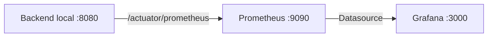

# Guía de Grafana local — Ganadería 4.0

## 1. Propósito

Grafana permite visualizar métricas del backend Ganadería 4.0 recolectadas por Prometheus. Esta guía explica cómo levantar el stack local de observabilidad y abrir un dashboard inicial sin modificar código productivo ni seguridad.

## 2. Arquitectura local



## 3. Requisitos

- Docker Desktop.
- Backend local corriendo.
- Prometheus configurado.
- Puerto `9090` libre.
- Puerto `3000` libre.
- `/actuator/prometheus` accesible.

Si `/actuator/prometheus` está protegido por seguridad, Prometheus no podrá recolectar métricas sin una estrategia controlada de acceso. Esta subfase no cambia autenticación ni autorización.

## 4. Levantar stack de observabilidad

Desde la raíz del repositorio:

```powershell
docker compose -f docker-compose.observability.yml up -d
```

Esto levanta:

- `ganaderia4-prometheus`.
- `ganaderia4-grafana`.

## 5. Acceder a Grafana

Abrir:

```text
http://localhost:3000
```

Credenciales locales demo:

- Usuario: `admin`.
- Password: `admin`.

Estas credenciales son solo para observabilidad local/demo y no deben usarse en producción.

## 6. Validar datasource

En Grafana:

```text
Connections -> Data sources
```

Confirmar:

- Datasource: `Prometheus`.
- URL interna: `http://prometheus:9090`.
- Estado accesible cuando el contenedor Prometheus está arriba.

## 7. Validar dashboard

En Grafana:

```text
Dashboards
```

Buscar:

```text
Ganadería 4.0 — Backend Overview
```

Resultado esperado:

- Panel `Backend UP` muestra datos si Prometheus puede scrapear el backend.
- Paneles HTTP/JVM muestran datos si el backend recibe requests y `/actuator/prometheus` es accesible.
- Paneles de dominio muestran datos cuando ocurren eventos reales del backend: alertas, device ingestion, notificaciones, outbox EMAIL, IA o jobs de limpieza.

## 8. Paneles disponibles

El dashboard `Ganadería 4.0 — Backend Overview` incluye:

- `Backend UP`: estado del target scrapeado por Prometheus.
- `Process uptime`: tiempo de vida del proceso backend.
- `HTTP request rate`: tasa global de requests HTTP.
- `HTTP latency p95`: percentil 95 aproximado de latencia HTTP.
- `HTTP requests by URI/status`: tasa por método, URI y status.
- `HTTP error rate`: tasa de respuestas `4xx` y `5xx`.
- `JVM memory used`: uso de memoria JVM por área.
- `Alert lifecycle rate`: alertas creadas, resueltas y descartadas por tipo.
- `Device ingestion requests`: requests IoT aceptados y rechazados por razón.
- `GPS accuracy quality`: calidad GPS reportada por telemetría.
- `Notifications by channel`: notificaciones enviadas, fallidas y encoladas por canal/evento.
- `Outbox EMAIL outcomes`: mensajes EMAIL enviados, fallidos, DEAD y recuperaciones de PROCESSING atascado.
- `AI summaries and provider outcomes`: resúmenes generados, fallback IA y resultados del proveedor.
- `Cleanup deleted records`: registros eliminados por jobs de limpieza de nonces, abuse rate limit y password reset.

## 9. Consultas útiles

Consultas generales:

```promql
up
```

```promql
http_server_requests_seconds_count
```

```promql
rate(http_server_requests_seconds_count[5m])
```

```promql
rate(http_server_requests_seconds_sum[5m]) / rate(http_server_requests_seconds_count[5m])
```

```promql
jvm_memory_used_bytes
```

```promql
process_uptime_seconds
```

Consultas de dominio verificadas:

```promql
ganaderia_device_requests_accepted_total
```

```promql
ganaderia_device_requests_rejected_total
```

```promql
ganaderia_alerts_created_total
```

```promql
ganaderia_alerts_resolved_total
```

```promql
ganaderia_alerts_discarded_total
```

```promql
ganaderia_gps_accuracy_quality_count_total
```

```promql
ganaderia_notifications_sent_total
```

```promql
ganaderia_notifications_failed_total
```

```promql
ganaderia_notifications_queued_total
```

```promql
ganaderia_notification_outbox_email_sent_count_total
```

```promql
ganaderia_notification_outbox_email_failed_count_total
```

```promql
ganaderia_notification_outbox_email_dead_count_total
```

```promql
ganaderia_ai_summary_generated_count_total
```

```promql
ganaderia_ai_summary_fallback_count_total
```

```promql
ganaderia_ai_summary_provider_request_count_total
```

```promql
ganaderia_device_replay_nonce_cleanup_deleted_count_total
```

```promql
ganaderia_abuse_rate_limit_cleanup_deleted_count_total
```

```promql
ganaderia_auth_password_reset_cleanup_deleted_count_total
```

## 10. Cómo interpretar métricas de dominio

- Un aumento de `5xx` requiere revisar logs del backend y correlacionar con `X-Request-Id`.
- Rechazos altos en device ingestion pueden indicar firma HMAC inválida, timestamp fuera de ventana, nonce repetido o token desconocido.
- Fallback IA alto puede indicar que Gemini está deshabilitado, mal configurado o fallando.
- Outbox EMAIL con `failed`, `dead` o `stuck dead` requiere revisar el endpoint admin del outbox.
- Métricas de cleanup con valores altos pueden ser normales después de periodos largos sin limpieza o pruebas intensivas.
- Paneles `No data` no siempre indican fallo: algunos counters solo aparecen después de que ocurre el primer evento.

## 11. Troubleshooting

| Problema | Causa probable | Solución |
| --- | --- | --- |
| Grafana no abre | Docker Desktop apagado o puerto 3000 ocupado | Iniciar Docker o liberar/cambiar el puerto. |
| Prometheus datasource DOWN | Contenedor Prometheus no inició o URL interna incorrecta | Revisar `docker compose ps` y datasource provisionado. |
| Dashboard sin datos | Prometheus no scrapea backend o aún no hay tráfico | Revisar targets y generar requests al backend. |
| Panel con `No data` | La métrica aún no fue emitida porque no ocurrió el evento | Ejecutar el flujo correspondiente o esperar al job programado. |
| Métrica no aparece | Nombre incorrecto, endpoint protegido o evento no ejecutado | Revisar `/actuator/prometheus` y logs del backend. |
| Target Prometheus DOWN | Backend local apagado o endpoint inaccesible | Levantar backend y validar `/actuator/prometheus`. |
| `/actuator/prometheus` devuelve 401/403 | Endpoint protegido por seguridad | No desactivar seguridad; definir estrategia controlada. |
| Puerto 3000 ocupado | Otro servicio usa Grafana o puerto local | Detener servicio o cambiar mapeo local. |
| Puerto 9090 ocupado | Otro Prometheus usa el puerto | Detener servicio o cambiar mapeo local. |
| Backend local no está corriendo | App detenida o puerto incorrecto | Ejecutar `.\mvnw.cmd spring-boot:run`. |
| Docker Desktop apagado | Docker no puede iniciar contenedores | Iniciar Docker Desktop y repetir `up -d`. |

## 12. Seguridad

- No poner JWT en Grafana.
- No poner API keys.
- No poner DeviceSecret.
- No poner credenciales reales.
- No usar `admin/admin` en producción.
- No desactivar seguridad del backend solo para que Grafana funcione.
- Si Actuator está protegido, definir estrategia controlada en ambiente seguro.

## 13. Apagar stack

```powershell
docker compose -f docker-compose.observability.yml down
```

## 14. Criterio de aceptación

La subfase queda lista si:

- `docker-compose.observability.yml` incluye Prometheus y Grafana.
- Grafana carga en `http://localhost:3000`.
- Datasource Prometheus queda provisionado.
- Dashboard con métricas técnicas y de dominio queda provisionado.
- No se tocaron Java/configuración productiva.
- No hay secretos.
- La guía explica uso y troubleshooting.
