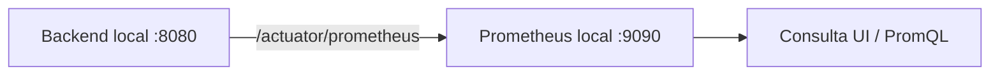

# Guía de observabilidad local — Ganadería 4.0

## 1. Propósito

Esta guía permite levantar Prometheus localmente para consultar métricas expuestas por el backend Ganadería 4.0 en `/actuator/prometheus`.

La configuración es local y de apoyo para desarrollo o demo técnica. No modifica código productivo, seguridad, Actuator ni configuración de Spring Boot.

## 2. Arquitectura local

Flujo esperado:



Prometheus corre en Docker y scrapea el backend local mediante:

```text
host.docker.internal:8080
```

En Windows y Mac, `host.docker.internal` permite que un contenedor Docker alcance servicios que corren en la máquina host.

## 3. Requisitos

- Docker Desktop.
- Backend local corriendo.
- Puerto `8080` disponible para el backend.
- Puerto `9090` disponible para Prometheus.
- Actuator Prometheus habilitado.
- Endpoint `/actuator/prometheus` accesible según seguridad.

Nota: si `/actuator/prometheus` está protegido por JWT/roles, Prometheus no podrá scrapearlo sin configuración adicional de autenticación o sin una decisión explícita de exposición controlada. Esta subfase no cambia la seguridad.

## 4. Levantar backend local

Usar el mecanismo habitual del proyecto. Opción Maven Wrapper:

```powershell
.\mvnw.cmd spring-boot:run
```

Validaciones rápidas:

```text
http://localhost:8080/healthz
http://localhost:8080/actuator/health
http://localhost:8080/actuator/prometheus
```

## 5. Levantar Prometheus

Desde la raíz del repositorio:

```powershell
docker compose -f docker-compose.observability.yml up -d
```

Esto inicia un contenedor llamado:

```text
ganaderia4-prometheus
```

## 6. Abrir Prometheus

Abrir:

```text
http://localhost:9090
```

## 7. Validar targets

En Prometheus:

```text
Status -> Targets
```

Resultado esperado:

- `ganaderia4-backend-local` aparece `UP` si el backend está corriendo y `/actuator/prometheus` es accesible.
- `ganaderia4-backend-local` aparece `DOWN` si el backend no está corriendo, el puerto no coincide, `host.docker.internal` no resuelve o el endpoint está protegido.

## 8. Consultas útiles

Consultas genéricas de Spring/Micrometer:

```promql
up
```

```promql
http_server_requests_seconds_count
```

```promql
http_server_requests_seconds_sum
```

```promql
jvm_memory_used_bytes
```

```promql
process_uptime_seconds
```

Métricas de dominio verificadas en el backend:

```promql
ganaderia_device_requests_accepted_total
```

```promql
ganaderia_device_requests_rejected_total
```

```promql
ganaderia_notifications_sent_total
```

```promql
ganaderia_notifications_failed_total
```

```promql
ganaderia_ai_summary_generated_count_total
```

```promql
ganaderia_ai_summary_fallback_count_total
```

```promql
ganaderia_notification_outbox_email_sent_count_total
```

```promql
ganaderia_notification_outbox_email_failed_count_total
```

Micrometer convierte nombres con puntos a nombres Prometheus con guiones bajos y agrega sufijos como `_total` para contadores.

## 9. Escenario Render

El archivo `observability/prometheus/prometheus.yml` deja el target Render comentado por defecto:

```yaml
# - job_name: "ganaderia4-backend-render"
#   scheme: "https"
#   metrics_path: "/actuator/prometheus"
#   static_configs:
#     - targets: ["ganaderia-backend.onrender.com"]
```

Puede activarse manualmente si:

- `/actuator/prometheus` es accesible.
- La seguridad lo permite.
- Se acepta scrapear el backend desplegado.

No se recomienda desactivar Spring Security para facilitar Prometheus. Si se necesita monitoreo productivo, definir una estrategia controlada de exposición/autenticación.

## 10. Troubleshooting

| Problema | Causa probable | Solución |
| --- | --- | --- |
| Prometheus no abre | Docker Desktop apagado o puerto 9090 ocupado | Iniciar Docker Desktop o liberar/cambiar el puerto. |
| Target `DOWN` | Backend local no está corriendo | Levantar backend y revisar `http://localhost:8080/healthz`. |
| `host.docker.internal` no resuelve | Entorno Docker/Linux sin alias disponible | Usar IP del host o configurar host gateway según el entorno. |
| `/actuator/prometheus` devuelve 401/403 | Endpoint protegido por seguridad | No desactivar seguridad; definir acceso controlado o probar con endpoint accesible. |
| Backend no está corriendo | Aplicación detenida o puerto incorrecto | Ejecutar `.\mvnw.cmd spring-boot:run` y confirmar puerto 8080. |
| Puerto 9090 ocupado | Otro Prometheus/servicio usa el puerto | Detener servicio previo o cambiar mapeo en compose local. |
| Docker Desktop apagado | Docker no puede crear contenedor | Iniciar Docker Desktop y repetir `docker compose up -d`. |
| Métrica no aparece | No se generó el evento o el nombre Prometheus difiere | Generar tráfico y buscar por prefijo, por ejemplo `ganaderia_`. |

## 11. Seguridad

- No incluir JWT en `prometheus.yml`.
- No incluir API keys.
- No incluir DeviceSecret.
- No incluir contraseñas.
- No abrir Actuator públicamente sin control.
- No desactivar Spring Security para demo.
- No commitear archivos locales con bearer tokens o credenciales.

## 12. Apagar Prometheus

Desde la raíz del repositorio:

```powershell
docker compose -f docker-compose.observability.yml down
```

## 13. Criterio de aceptación

La subfase queda lista si:

- Existe `docker-compose.observability.yml`.
- Existe `observability/prometheus/prometheus.yml`.
- Existe `docs/observability-local-guide.md`.
- No se tocó Java ni configuración productiva.
- No hay secretos.
- Prometheus puede levantarse localmente.
- El target local queda documentado.
